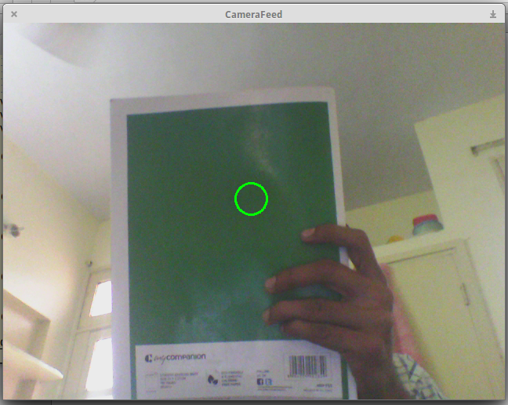

This repository contains the material required for OpenCV demonstration.
The demonstration will cover basic image processing and by the end of the
demonstration we aim to write a program which can track objects based on
their color and motion. It would be desirable that any person attending the
workshop comes with his/her own laptop with OpenCV installed. The
installation instructions are given below. Also to be able to test if the 
code is correctly working, it would be helpful if you bring a distinctly
colored object.

The code written during the demonstration has been uploaded
in the repository. The code tracks green objects by default. To begin tracking
press 'T', to exit the program press 'Q'.



# Installing OpenCV
Run the command corresponding to your OS in the terminal

* __Ubuntu, Linux Mint, Debian__: `$ sudo apt-get install libopencv-dev`
* __Arch__: `$ sudo pacman -S opencv`
* __Windows__:
    * Install the trial version of Ceemple IDE from [https://www.ceemple.com/getceemple/](https://www.ceemple.com/getceemple/) *(preferred)*
    * OR Install OpenCV from [http://opencv.org/downloads.html](http://opencv.org/downloads.html) and configure it for any IDE of your choice
        * [Visual Studio](https://www.youtube.com/watch?v=e_TQ9c3n_d8)
        * [Code::Blocks](https://zahidhasan.wordpress.com/2013/02/16/how-to-install-opencv-on-windows-7-64bit-using-mingw-64-and-codeblocks/)

The demonstration will be done using *Ceemple IDE* for windows and OpenCV installed on *Ubuntu*

# Post - Installation
### Linux: 
Start the terminal and clone the repository, navigate to the test folder and run the Makefile
```
$ git clone https://www.github.com/lakshayg/opencv-demo
$ cd opencv-demo/test
$ make
```
### Windows:
* Download the repository by clicking on this link [https://github.com/lakshayg/opencv-demo/archive/master.zip](https://github.com/lakshayg/opencv-demo/archive/master.zip)
* Extract the zip archive and open the file test.cpp in the folder test in any IDE
* Compile and run using your IDE to check if OpenCV is installed correctly

If you see a window showing the webcam output then you have successfully installed OpenCV.
Press 'x' to exit.
# Compiling
The .cpp files made during the demonstration can be compiled using

```$ g++ file.cpp -o file `pkg-config opencv --libs` ```

# Contact

In case of problems during the setup, you can contact us at *lakshayg373@gmail.com*


# __too long; didn't read__
When attending the demonstration try to:

* Bring a laptop with OpenCV installed
* Bring a distinctly colored object
* In case of any problems, contact *lakshayg373@gmail.com*
* Do attend even if you are not able to arrange for these items
